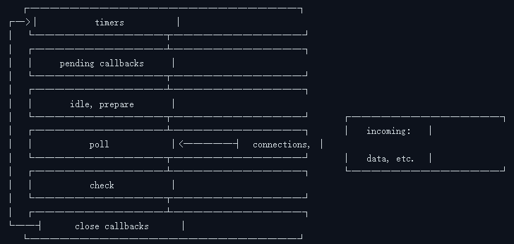

## 事件循环

[参考](https://nodejs.org/zh-cn/learn/asynchronous-work/event-loop-timers-and-nexttick)

Node.js 事件循环是一个基于 libuv 事件驱动的循环机制，用于处理异步操作。它是 node 平台的核心机制，负责管理和执行异步任务。

跟浏览器的事件循环不同，Node.js 的事件循环是单线程的，但是它可以处理大量的并发连接。而浏览器的事件循环是多线程的，每个标签页都有一个事件循环。

### 核心概念

事件循环是一个持续运行的循环，负责处理异步回调。它检查调用栈（Call Stack）是否为空，然后从任务队列（Task Queue）中取出回调执行。

事件循环有 6 个阶段：

- timers: 执行 setTimeout() 和 setInterval() 回调。
- pending callbacks: 执行延迟到下一个循环迭代的 I/O 回调。
- idle, prepare: 仅用于内部。
- poll: 轮询阶段，用于获取新的 I/O 事件并执行相关回调。当没有其他异步任务时，Node.js 会阻塞在这里。
- check: 执行 setImmediate() 回调。
- close callbacks: 执行关闭回调，如 socket.on('close', ...)。

### timers
